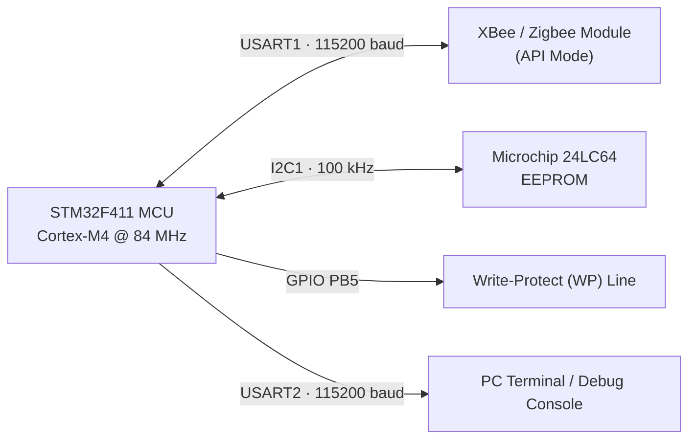

# 🛰️ Secure STM32 Wireless Telemetry Node 

### Encrypted Zigbee Telemetry · Hardware-Protected EEPROM Logging · Dual-Board Mesh Architecture

[](https://www.st.com/en/evaluation-tools/nucleo-f411re.html)
[]()
[]()
[]()
[]()
[]()

> A dual-node industrial telemetry system built on the **STM32 NUCLEO-F411RE**, combining obfuscated over-the-air Zigbee messaging with hardware write-protected local data logging — designed and implemented by **Hasinu Ravishka** at the **University of Hertfordshire** (Module 6ENT1180).

---

## Table of Contents

- [Overview](#-overview)
- [System Architecture](#-system-architecture)
- [Key Features](#-key-features)
- [Peripheral Pin Mapping](#-peripheral-pin-mapping)
- [Project Structure](#-project-structure)
- [Getting Started](#-getting-started)
- [Runtime Behaviour](#-runtime-behaviour)
- [Author](#-author)

---

## 🔎 Overview

This project implements a **bidirectional wireless sensor node** that acquires simulated environmental data, obfuscates it before transmission, and exchanges it with a paired node over a **Zigbee API-mode radio link**. One node doubles as a **non-volatile data logger**, persisting readings to an external I2C EEPROM guarded by an active hardware write-protect line.

The firmware is written entirely in embedded C for STM32CubeIDE / HAL, and is structured so that a single codebase can be compiled into *either* role — sender or receiver — via a simple preprocessor flag.

**Core capabilities at a glance:**

| Capability | Description |
|---|---|
| 📡 Zigbee API Engine | Builds and parses raw XBee API frames (`0x10`, `0x90`, `0x91`) with checksum validation |
| 🔐 Payload Obfuscation | XOR-masked telemetry and acknowledgment bytes |
| 💾 EEPROM Persistence | Page-safe I2C driver for the Microchip 24LC64, with float-to-byte serialization |
| 🛡️ Hardware Write Protection | GPIO-controlled `WP` line toggled dynamically around write operations |
| 🩹 Self-Healing UART | Automatic detection and clearing of overrun/framing errors |
| 💡 Visual Diagnostics | Status LED feedback for TX, RX, and EEPROM activity |

---

## 🏗 System Architecture



Two identically-flashed boards form a minimal mesh: **Board 1** initiates telemetry from a simulated Zone 1 sensor, while **Board 2** receives, decodes, and archives Zone 2 readings to EEPROM — with roles fully interchangeable via a single build-time macro.

---

## ⚙️ Key Features

### 1. Robust XBee / Zigbee API Protocol Engine
- **API Frame Construction** — Builds `0x10` Transmit Request frames for outbound telemetry.
- **API Frame Parsing** — Decodes incoming `0x90` (Standard RX) and `0x91` (Explicit RX) frames.
- **Checksum Verification** — Every inbound frame is validated using the standard `0xFF - sum` modular checksum before its payload is trusted.
- **Automatic Link Recovery** — USART1 is continuously monitored for Overrun (`ORE`) and Framing (`FE`) errors, which are cleared automatically to keep the link alive without manual intervention.

### 2. Microchip 24LC64 I2C EEPROM Driver
- **Page-Boundary Safety** — Multi-byte writes are calculated against a `32-byte` page size across `256` pages, eliminating address-rollover corruption.
- **IEEE-754 Float Serialization** — A `FloatUnion` type bridges raw byte buffers and floating-point sensor values for clean, portable storage.
- **Active Write-Protect Control** — The `WP` GPIO line is driven `HIGH` (protect) by default and pulled `LOW` only for the duration of a write, minimizing the write-vulnerable window.

### 3. Lightweight Payload Security
- **XOR Obfuscation Layer** — Outbound Zone ID and temperature values are masked with a `0x5A` key; inbound acknowledgment bytes use a `0xAC` mask — a simple but effective deterrent against casual payload sniffing.

---

## 🔌 Peripheral Pin Mapping

| Peripheral | STM32 Pin | Configuration | Description |
|---|---|---|---|
| **USART1_TX** | `PA9`  | 115200 baud, 8N1 | XBee module transmit line |
| **USART1_RX** | `PA10` | 115200 baud, 8N1 | XBee module receive line |
| **USART2_TX** | `PA2`  | 115200 baud, 8N1 | PC debug console output |
| **USART2_RX** | `PA3`  | 115200 baud, 8N1 | PC debug console input |
| **I2C1_SCL**  | `PB6` / `PB8` | 100 kHz standard mode | EEPROM clock line |
| **I2C1_SDA**  | `PB7` / `PB9` | 100 kHz standard mode | EEPROM data line |
| **EEPROM WP** | `PB5`  | Push-pull output | Hardware write protect (`HIGH` = protect, `LOW` = write-enable) |
| **Status LED**| `PA5`  | Push-pull output | Visual pulse for TX / RX / EEPROM events |
| **User Button**| `PC13` | Internal pull-up | Triggers manual EEPROM read-back |

---

## 📂 Project Structure

```text
Inc/
├── EEPROM.h        # 24LC64 driver function signatures and macros
├── Zigbee.h        # XBee API frame definitions and checksum headers
└── main.h          # Core system includes & CubeMX-generated exports

Src/
├── EEPROM.c        # Page-boundary-aware I2C EEPROM driver implementation
├── Zigbee.c        # API frame construction & checksum calculation logic
├── main_sender.c   # Application loop configured for Board 1 (sender)
└── main_receive.c  # Application loop configured for Board 2 (receiver/logger)

README.md           # You are here
```

---

## 🚀 Getting Started

### Selecting a Board Role

Board behaviour is resolved entirely at compile time via a single macro in `main.c`:

```c
#define THIS_BOARD 1   // Board 1: initiates Zone 1 telemetry, starting at 20 °C
#define THIS_BOARD 2   // Board 2: receives Zone 2 telemetry, starting at 35 °C, + EEPROM logging
```

### Build & Flash

1. **Import** the source tree into **STM32CubeIDE**.
2. **Verify the clock tree** — the System Clock must be configured via RCC for **84 MHz** using the internal HSI/PLL path.
3. **Flash Board 1** with `THIS_BOARD` set to `1`.
4. **Flash Board 2** with `THIS_BOARD` set to `2`.
5. **Open a serial terminal** (PuTTY, Tera Term, etc.) on the ST-LINK Virtual COM Port at **115200 baud** to observe live transmission, payload decryption, and EEPROM write events.

---

## 📊 Runtime Behaviour

Once both boards are powered and paired over Zigbee:

- **Board 1** samples its simulated Zone 1 temperature, XOR-obfuscates the payload, and transmits it as a `0x10` API frame at a fixed interval.
- **Board 2** validates each incoming frame's checksum, reverses the XOR mask, logs the decoded reading to the 24LC64 EEPROM (toggling `WP` low only for the write), and returns an obfuscated acknowledgment.
- **The status LED** on each board pulses to reflect TX, RX, and EEPROM activity in real time.
- **Pressing the user button** on the logging board triggers a manual read-back of stored telemetry from EEPROM to the debug console.

---

## 👤 Author

**Hasinu Ravishka**
University of Hertfordshire — Module 6ENT1180
*Embedded Systems / Wireless Telemetry Coursework*

---

<p align="center"><i>Built with embedded C, a healthy respect for checksum math, and one very patient logic analyzer.</i></p>
